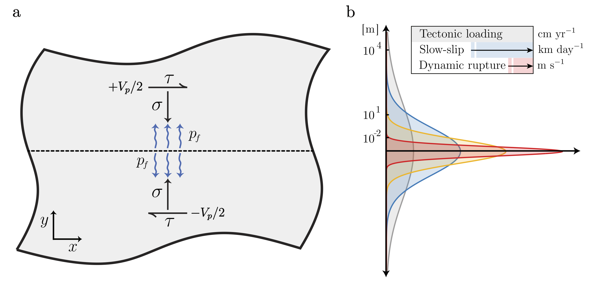
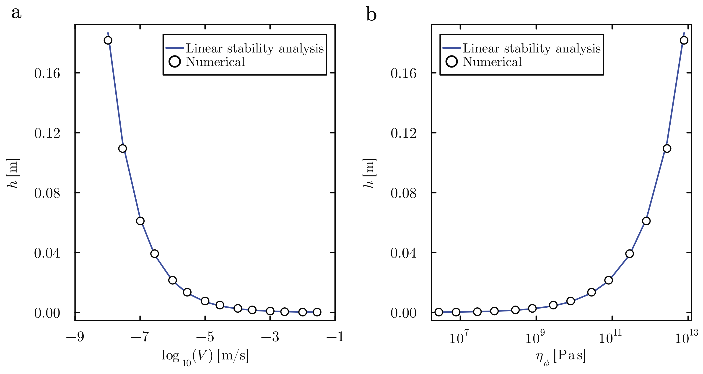
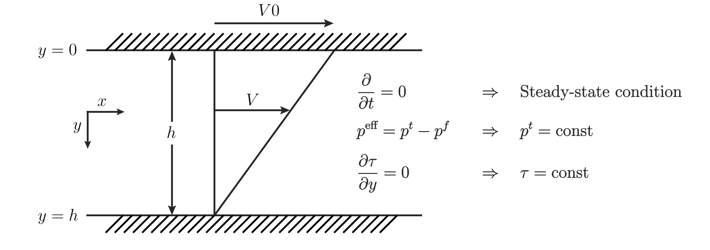
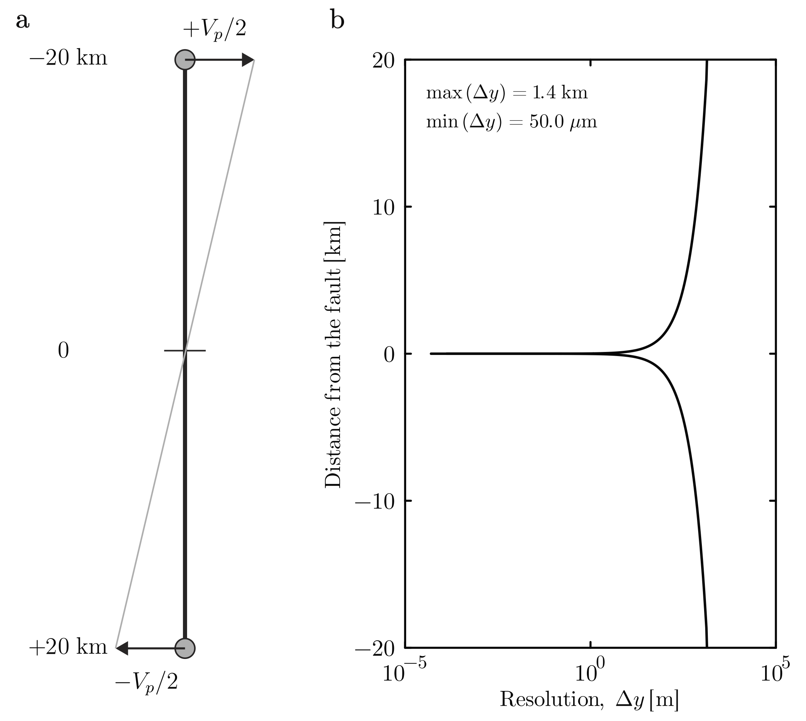
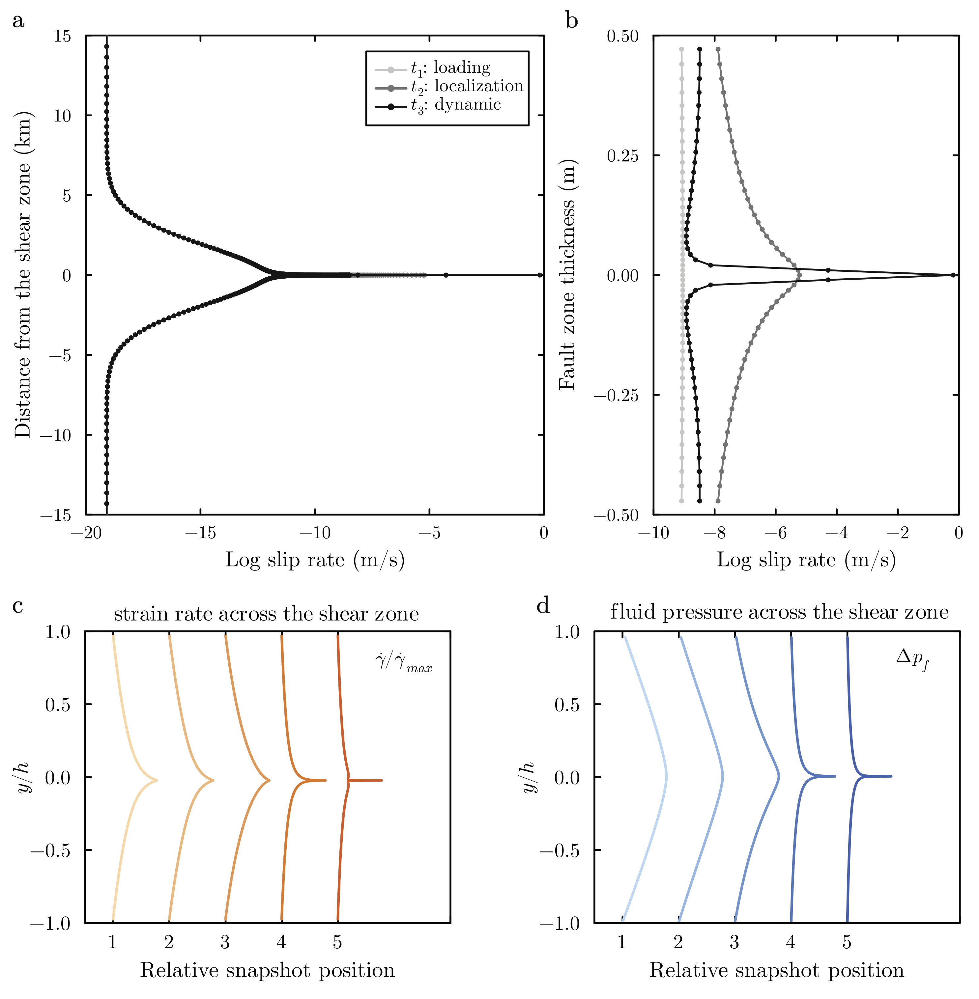
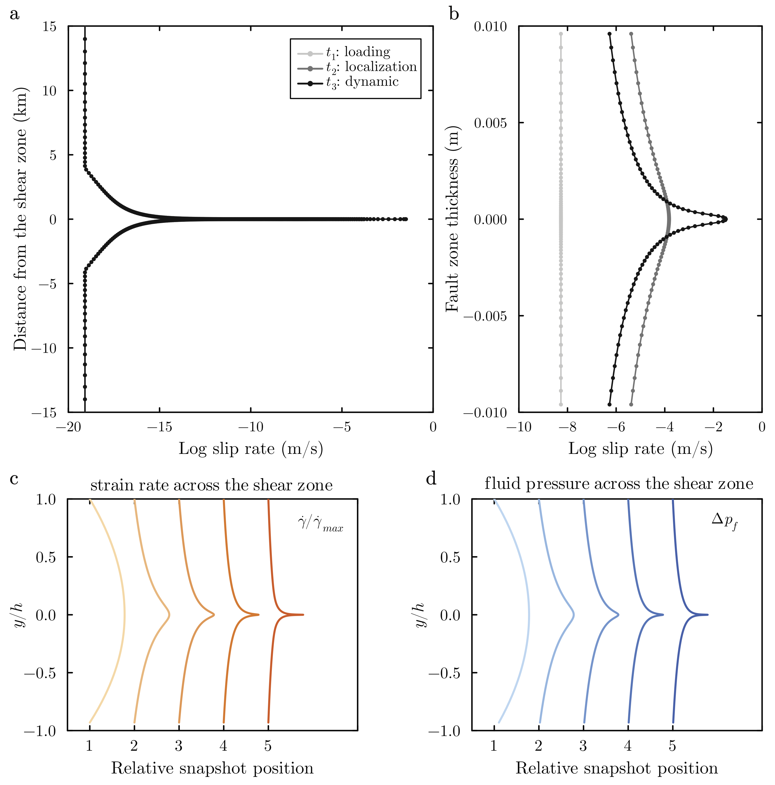
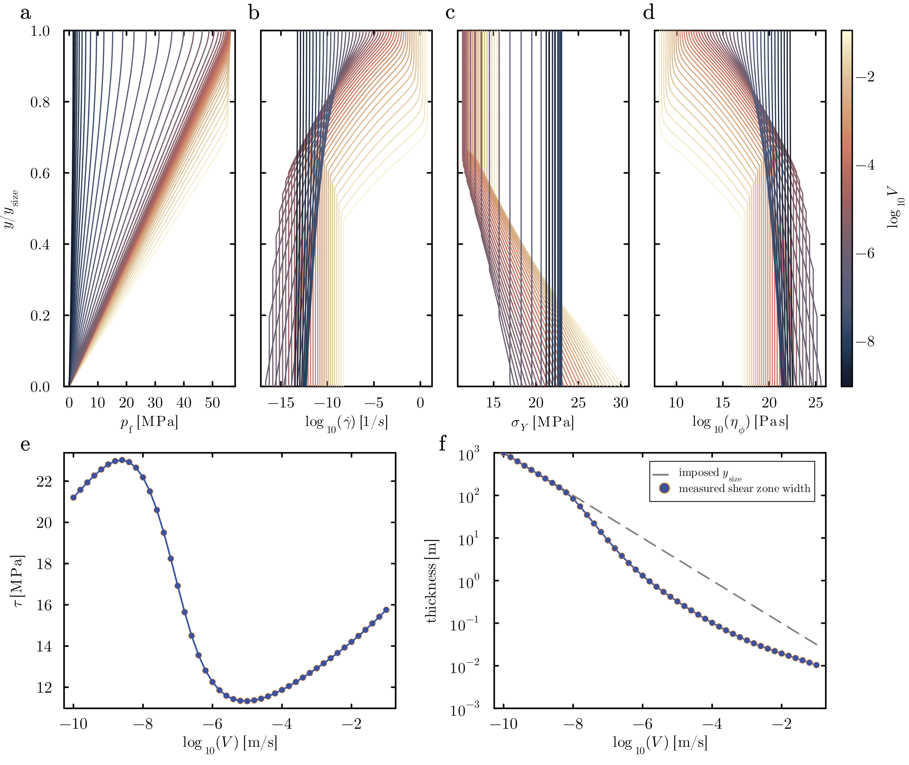
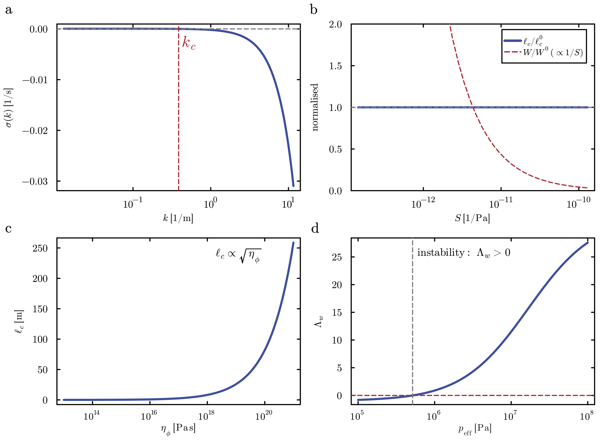

# H-MEC 1D — Hydro-Mechanical Earthquake Cycles

**Fluid-driven strain localization and the physically-selected thickness of dynamic shear bands in poromechanical fault zones.**

This repository contains the Julia code accompanying

> **Dal Zilio, L. & Gerya, T.** *Fluid-driven strain localization controls earthquake rupture dynamics in poromechanical fault zones* (2025).

It implements a one-dimensional, fully two-phase (solid + fluid) **Hydro-Mechanical Earthquake Cycles (H-MEC)** solver, together with the semi-analytical and analytical tools used to explain its results: a 1D steady-state Couette reduction, a linear stability analysis (LSA), and the scripts that reproduce every figure of the paper.

The scientific question is deceptively simple: **what sets the width of the shear band that forms during an earthquake?** Classical rate-and-state friction (RSF), when embedded in a continuum, has *no internal length scale* — the band collapses onto a single grid cell and the answer becomes the mesh size. We show that explicitly coupling **rate-strengthening visco-plasticity** to **two-phase poromechanics** introduces a *physical* length scale — set by the competition between **pore-fluid pressure diffusion** (stabilizing) and **effective-stress weakening** (destabilizing) — that yields **mesh-convergent** shear bands whose thickness is predictable from material parameters alone.

<p align="center">
 
</p>
<p align="center"><em>A fluid-saturated fault element under shear (left): pore pressure <code>p_f</code> modulates the effective normal stress. The active deformation-zone thickness spans the full slip spectrum (right) — from broad tectonic loading, through meter-scale slow slip, to a thin principal slip zone during dynamic rupture.</em></p>

---

## Table of contents

- [Key result](#key-result)
- [Repository layout](#repository-layout)
- [Physics and governing equations](#physics-and-governing-equations)
 - [Two-phase conservation laws](#two-phase-conservation-laws)
 - [Two constitutive choices for fault rheology](#two-constitutive-choices-for-fault-rheology)
 - [The compaction-viscosity closure](#the-compaction-viscosity-closure)
- [Numerical algorithm](#numerical-algorithm)
- [Analytical theory](#analytical-theory)
 - [1D steady-state Couette reduction](#1-1d-steady-state-couette-reduction--the-passive-pressure-decay-length)
 - [Linear stability analysis](#2-linear-stability-analysis--the-selected-wavelength)
- [Figures and the scripts that produce them](#figures-and-the-scripts-that-produce-them)
- [Reference parameters](#reference-parameters)
- [Getting started](#getting-started)
- [Reproducing the paper](#reproducing-the-paper)
- [Citation](#citation)
- [Authors and license](#authors-and-license)

---

## Key result

In a fluid-saturated fault, the dynamic shear-band thickness is **not** a property of the discretization but of the rock. Linear stability analysis predicts a marginal wavelength, and the band that forms is approximately one wavelength wide:

$$
h = \kappa \lambda_c = 2\pi\kappa\sqrt{\frac{(1-\phi)\eta_\phi k}{\Lambda_w \eta_f}}
\simeq 2\pi\kappa \sqrt{\frac{k \eta_s}{\phi \Lambda_w \eta_f}},
$$

with a single order-unity calibration constant $\kappa\simeq1.2$ and **no adjustable physical parameter**. The prediction matches fully dynamic simulations across the full range of compaction viscosities. For seismogenic conditions it gives sub-centimeter principal slip zones at $\mathrm{m/s}$ slip rates; for low-permeability / high-viscosity conditions it broadens to meter-scale zones characteristic of slow slip.

<p align="center">
 
</p>

---

## Repository layout

```
H-MEC-1D.jl/
├── src/
│ └── h_mec_1D.jl # The 1D H-MEC dynamic solver (both rheologies)
├── analysis/
│ ├── 1D_steady_state.jl # Steady-state Couette reduction (Fig. 6)
│ ├── LSA_dispersion_analysis.jl # Linear stability / dispersion relation (Fig. 7)
│ └── analytical_vs_modeling.jl # Numerics vs LSA band-thickness scaling (Fig. 8)
├── plotting/
│ ├── plot_setup.jl # Non-uniform grid resolution (Fig. 2b)
│ ├── plot_vslip_snapshots.jl # Slip-rate profiles, full + zoom (Figs. 4a,b / 5a,b)
│ ├── plot_eps_pf_snapshots.jl # Strain-rate & fluid-pressure profiles (Figs. 4c,d / 5c,d)
│ └── plot_couette_results.jl # τ(V), width(V), internal profiles (Fig. 6)
├── figures/
│ ├── figure1.pdf … figure8.pdf # Vector figures from the manuscript
│ └── png/ # Raster previews used in this README
├── results/ # Shared I/O directory (created at run time)
├── Project.toml # Julia environment / dependencies
├── LICENSE
└── README.md
```

**A note on the directory structure and I/O.** The solver and the post-processing scripts communicate through plain-text evolution files (`EVO_*.txt`, `fault.txt`, `couette_*.txt`) and `JLD2` checkpoints. To keep a clean source tree while preserving this data flow, **every script reads from and writes to a single shared `results/` directory at the repository root** (resolved relative to each script, overridable with the `HMEC_RESULTS` environment variable). You can therefore run any script from anywhere and they will all see the same data.

---

## Physics and governing equations

H-MEC treats a fluid-saturated fault zone as a **fully compressible, two-phase porous continuum** in which solid deformation and fluid flow are coupled through volumetric conservation laws and an effective-stress constitutive description. The model is solved on a staggered Eulerian grid with a Newton-type iterative solver and adaptive time stepping spanning tectonic loading ($\Delta t \sim 10^{8} \mathrm{s}$) to dynamic rupture ($\Delta t \sim 10^{-4} \mathrm{s}$).

The quantity that governs frictional strength and viscous compaction is the **effective pressure**

$$
p_\mathrm{eff} \equiv p_t - p_f,
$$

the difference between the total pressure $p_t$ and the pore-fluid pressure $p_f$.

### Two-phase conservation laws

**(i) Total momentum** (inertia retained for the dynamic phase):

$$
\frac{\partial \sigma^{t}_{ij}}{\partial x_j} + \rho_t g_i = \rho_t \frac{D_s v^{s}_i}{Dt},
 
\sigma^{t}_{ij} = \sigma'_{ij} - p_t \delta_{ij},
$$

with $\rho_t = (1-\phi)\rho_s + \phi\rho_f$ the bulk density, $\phi$ porosity, and $v^s$ the solid velocity.

**(ii) Darcy's law** for the fluid, with Darcy flux:

$$
v_D = \phi\left(v^f - v^s\right)
$$

$$
v_D = -\frac{k(\phi)}{\eta_f}\left(\nabla p_f - \rho_f g\right).
$$

**(iii) Compressible mass conservation** of the solid and fluid phases:

$$
\nabla\cdot v^{s} = -\frac{1}{K_d}\left(\frac{D_s p_t}{Dt} - \alpha \frac{D_f p_f}{Dt}\right) - \frac{p_\mathrm{eff}}{\eta_\phi(1-\phi)},
$$

$$
\nabla\cdot v_D = \frac{\alpha}{K_d}\left(\frac{D_s p_t}{Dt} - \frac{1}{B}\frac{D_f p_f}{Dt}\right) + \frac{p_\mathrm{eff}}{\eta_\phi(1-\phi)},
$$

where $K_d$ is the drained bulk modulus, $\alpha$ the Biot–Willis coefficient, $B$ the Skempton coefficient, and $\eta_\phi$ the **compaction (bulk) viscosity**, which controls the rate at which a non-equilibrium effective pressure is dissipated by viscous compaction/dilation.

The deviatoric stress follows a **generalized Maxwell visco-elasto-plastic** relation,

$$
\sigma'_{ij} = 2 \eta_\mathrm{eff} \dot\varepsilon'_{ij} \chi + \sigma'^{ 0}_{ij}(1-\chi),
 
\chi = \frac{\Delta t G}{\Delta t G + \eta_\mathrm{eff}},
$$

with $\chi$ the visco-elasticity factor, $G$ the shear modulus, and $\sigma'^{ 0}_{ij}$ the stress at the previous time step. Porosity evolves through viscous compaction and shear-induced dilatancy:

$$
\frac{d\phi}{dt} = -\zeta_{vp} \phi + \zeta_{dil},
 
\zeta_{vp} = \frac{p_\mathrm{eff}}{\eta_\phi(1-\phi)},
 
\zeta_{dil} = \sin(\psi) |\dot\varepsilon_p|,
$$

where the dilation angle $\psi$ follows the empirical pressure-dependent formulation of Zhao & Cai (2010) (implemented in `src/h_mec_1D.jl` via the `ZC_*` constants).

In code, the six unknowns per node — $(p_t, v^s_x, v^s_y, p_f, v_{Dx}, v_{Dy})$ — are assembled into one sparse linear system (Section [Numerical algorithm](#numerical-algorithm)).

### Two constitutive choices for fault rheology

The constitutive law is the single modeling choice that decides whether dynamic localization is well-posed. The solver implements **both**, selected by one flag at the top of `src/h_mec_1D.jl`:

```julia
const rheology = :rate_and_state # or :rate_strengthening
```

**1. Rate-and-state friction (`:rate_and_state`) — the surface law, embedded.** 
The regularized (Lapusta et al., 2000) Dieterich–Ruina form

$$
\tau =
a p_\mathrm{eff} 
\sinh^{-1}\left[
\frac{V}{2V_0}
\exp\left(
\frac{\mu_0 + b\ln(V_0\theta/L)}{a}
\right)
\right]
$$

with aging-law state evolution $\dot\theta = 1 - V\theta/L$. In the continuum it is applied through a Drucker–Prager yield criterion with the slip rate replaced by the plastic strain-rate invariant, $V \to 2 \dot\varepsilon'_{II,p} w$. **This law contains no spatial diffusion operator, so the band collapses onto whichever cell weakens first** — the thickness simply tracks $\Delta y_\min$ (Fig. 4). The dynamic time step uses the Lapusta–Liu (2009) quasi-static stiffness criterion.

**2. Rate-strengthening visco-plasticity (`:rate_strengthening`) — the volumetric law.**
A non-associated, rate-dependent plasticity (Yi et al., 2018) in which the Drucker–Prager yield stress is scaled by a power law of the local shear strain rate $\dot\gamma$:

$$
\tau = \left(C + \mu_0 p_\mathrm{eff}\right)\left(\frac{\dot\gamma}{\dot\gamma_0}\right)^{a},
 
\dot\gamma = 2 \dot\varepsilon'_{II,p},
 
\dot\varepsilon'_{II,p} = \left(\tfrac12 \sum_{i,j}\dot\varepsilon'^{ p}_{ij}\dot\varepsilon'^{ p}_{ij}\right)^{1/2},
$$

with cohesion $C$, friction $\mu_0$, reference rate $\dot\gamma_0$, and rate-strengthening exponent $a\approx0.01$–$0.05$. Here the fault has a **finite thickness**, the rheology is **volumetric**, and pore pressure enters explicitly through $p_\mathrm{eff}$ in the yield envelope and through the conservation laws. Coupled to fluid diffusion, this yields **spontaneous, mesh-convergent** localization (Fig. 5).

Both branches solve their yield law point-by-point with a **bisection return-mapping** algorithm (tolerance $10^{-3}$); the visco-plastic viscosity $\eta_{vp} = \tau_{II}/(2\dot\varepsilon_{II,p})$ is then combined harmonically with the background viscosity.

### The compaction-viscosity closure

The compaction viscosity is **not** an independent parameter. From two-phase (compaction) theory (McKenzie 1984; Connolly & Podladchikov 1998),

$$
\eta_\phi = \frac{\eta_s}{\phi},
 
\frac{1}{\eta_s} = \frac{1}{\eta_s^0} + \frac{\dot\gamma_{pl}}{\tau}
 \xrightarrow[\text{yielding}]{} 
\eta_s = \frac{\tau}{\dot\gamma} = \frac{\tau_{II}}{2 \dot\varepsilon'_{II,p}} .
$$

Because $\eta_s \propto \tau/\dot\gamma$, the compaction viscosity **responds to changes in strain rate** — and this rate dependence is exactly what supplies the destabilizing feedback in the stability analysis below. The inverse-porosity scaling $\eta_\phi = \eta_s/\phi$ expresses that volumetric compaction must be accommodated by viscous flow through an ever-smaller solid fraction as $\phi\to0$.

---

## Numerical algorithm

The solver (`src/h_mec_1D.jl`) is a fully implicit, sparse, Newton-type scheme. The domain is a 40 km layer with $N_y = 481$ nodes refined **geometrically** toward the fault (minimum step 50 µm; see Fig. 2b), so the smallest expected shear band is resolved by $\geq 20$ nodes.

```
for each time step:
 choose Δt (RSF: Lapusta–Liu stiffness criterion; RS: elastic ceiling + slow growth)

 for each plastic iteration (inner loop, up to niterglobal):
 1. Update visco-plastic viscosity ηP, compaction viscosity ηB,
 and dilation angle ψ (Zhao & Cai) on pressure nodes.
 2. ASSEMBLE the global sparse system for the 6 unknowns per node
 (Pt, Vxs, Vys, Pf, VxD, VyD): X/Y total Stokes, solid continuity,
 X/Y Darcy, fluid continuity — with pressure-scaling for conditioning.
 3. SOLVE L · S = R (SuiteSparse LU factorization).
 4. Recover Pt, Vxs, Vys, Pf, VxD, VyD; compute strain rates,
 visco-elastic stresses, invariants, and shear heating.
 5. PLASTICITY (return mapping, per node):
 • :rate_and_state → regularized RSF + aging-law state update OM,
 bisection on τII, Lapusta–Liu Δt estimate.
 • :rate_strengthening→ power-law yield (Yi et al.), bisection on τII.
 Accumulate the yield-stress residual and slip-rate field.
 6. CONVERGENCE check on the plastic residual and the velocity ratio;
 adapt Δt (decrease on poor convergence / fast slip) and iterate.

 Commit stresses/pressures as initial conditions for the next step;
 append EVO_*.txt diagnostics; write a JLD2 checkpoint every savematstep.
```

Per-node degrees of freedom are interleaved (`kp, kx, ky, kpf, kxf, kyf`) and the band structure of the staggered stencil is hand-assembled into the COO triplet arrays `(LL, CL, VL)`. The code is allocation-light (work arrays are preallocated once) and supports **restart from a checkpoint** via the `restart_file` variable. The two rheologies share an identical checkpoint format.

---

## Analytical theory

The paper explains the numerical band thickness with two reductions of the full equations.

### 1. 1D steady-state Couette reduction — the *passive* pressure-decay length

Reducing the 2D equations to steady simple shear of a layer of thickness $H$ sheared by $\pm V_p/2$ (Fig. 3), with $\partial/\partial t = 0$, $\partial/\partial x = 0$, $v^s_y = 0$: the shear stress $\tau$ and total pressure $p_t$ are **uniform** across the layer, and the effective pressure obeys a Helmholtz equation

$$
\frac{k}{\eta_f} \frac{d^2 p_\mathrm{eff}}{dy^2} = \frac{p_\mathrm{eff}}{\eta_\phi(1-\phi)},
 
\boxed{\ell_p = \sqrt{\dfrac{k \eta_\phi(1-\phi)}{\eta_f}}}
$$

<p align="center"></p>
<p align="center"><em>The 1D steady-state Couette reduction: a layer of thickness <code>h</code> sheared by imposed boundary velocities. Steady state, uniform total pressure, and uniform shear stress reduce the effective pressure to a Helmholtz equation.</em></p>

The decay length $\ell_p$ is the geometric mean of a diffusion length and the fluid storage capacity; **the storativity cancels**, so $\ell_p$ depends only on $k$, $\eta_\phi$, $\eta_f$. For the reference parameters $\ell_p \approx 100 \mu\mathrm{m}$. The closure is the rate-strengthening yield law $\tau = (C + \mu_0 p_\mathrm{eff})(\dot\gamma/\dot\gamma_0)^a$. Implemented in `analysis/1D_steady_state.jl` by Picard iteration between a momentum sub-problem and a pressure sub-problem until $\max|\Delta p_\mathrm{eff}| < 10^{-3} \mathrm{Pa}$, sweeping the imposed velocity over twelve decades.

### 2. Linear stability analysis — the *selected* wavelength

Adding the rate-weakening feedback (Bai 1982; Rice et al. 2014; Barras & Brantut 2025): the diffusive internal variable is the pore pressure $p_f$, sourced by shear-driven viscous compaction,

$$
S \frac{\partial p_f}{\partial t} = \frac{k}{\eta_f} \frac{\partial^2 p_f}{\partial y^2} + \frac{p_\mathrm{eff}}{\eta_\phi(1-\phi)},
 
S = \phi\beta_f + (1-\phi)\beta_s .
$$

Perturbing with $\delta p_f \propto e^{\sigma t + i k y}$ and linearizing the yield law at uniform stress ($\delta\tau = 0$) gives the destabilizing feedback $\delta\dot\gamma/\dot\gamma = \mu_0 \delta p_f / [a(C+\mu_0 p_\mathrm{eff})]$, the rate-dependent compaction response $\delta\eta_\phi/\eta_\phi = -\delta\dot\gamma/\dot\gamma$, and the **dimensionless weakening number**

$$
\Lambda_w = \frac{\mu_0 p_\mathrm{eff}}{a (C + \mu_0 p_\mathrm{eff})} - 1 .
$$

The resulting **dispersion relation** balances Darcy diffusion against the compaction–weakening source:

$$
\sigma(k) = -D k^2 + W,
 
D = \frac{k}{\eta_f S},
 
W = \frac{\Lambda_w}{S \eta_\phi(1-\phi)} .
$$

Modes grow for $k < k_c$, with the marginal mode $\sigma(k_c)=0$ fixing

$$
k_c^2 = \frac{W}{D} = \frac{\Lambda_w \eta_f}{(1-\phi) \eta_\phi k},
 
\ell_c = k_c^{-1} = \frac{\ell_p}{\sqrt{\Lambda_w}},
 
\lambda_c = 2\pi\ell_c .
$$

**The storativity $S$ cancels in $\ell_c$** (it scales $D$ and $W$ identically): bulk compressibility sets the growth *rate*, not the *width*. Instability requires $\Lambda_w > 0$, i.e. $p_\mathrm{eff} > nC/[\mu_0(1-n)]$. The shear-band thickness is $h = \kappa\lambda_c$ (the [Key result](#key-result) box). Implemented in `analysis/LSA_dispersion_analysis.jl`.

---

## Figures and the scripts that produce them

| Fig | What it shows | Physics | Produced by |
|----|----------------|---------|-------------|
| 1 | Fault-zone shear element + slip spectrum | Conceptual: $p_f$ across a sheared fault; band thickness across tectonic / slow-slip / dynamic regimes | Conceptual (paper) |
| 2 | 1D setup + grid resolution | Sheared layer driven by $\pm V_p/2$; geometric refinement to 50 µm | `plotting/plot_setup.jl` (panel b) |
| 3 | Couette steady-state schematic | Assumptions $\partial_t=0,\ p_t=\text{const},\ \tau=\text{const}$ | Conceptual → `analysis/1D_steady_state.jl` |
| 4 | **RSF failure** (mesh collapse) | Slip rate / strain rate / $p_f$ collapse onto one cell — no internal length | `src/h_mec_1D.jl` (`:rate_and_state`) + `plotting/plot_vslip_snapshots.jl` (a,b) + `plotting/plot_eps_pf_snapshots.jl` (c,d) |
| 5 | **Mesh-convergent localization** | Rate-strengthening + fluids select a finite band independent of mesh | `src/h_mec_1D.jl` (`:rate_strengthening`) + same two plotting scripts |
| 6 | Couette results | $\tau(V)$ (U-shaped), measured width $\propto V^{-1}$, $p_\mathrm{eff}/\dot\gamma/\sigma_Y/\eta_\phi$ profiles | `analysis/1D_steady_state.jl` + `plotting/plot_couette_results.jl` |
| 7 | LSA dispersion | $\sigma(k)$ and $k_c$; $S$ cancels in $\ell_c$; $\ell_c\propto\sqrt{\eta_\phi}$; instability $\Lambda_w>0$ | `analysis/LSA_dispersion_analysis.jl` |
| 8 | Numerics vs theory | $h(V)$ and $h(\eta_\phi)$ collapse onto the LSA prediction ($\kappa\simeq1.2$, exponent $\approx0.47$) | `analysis/analytical_vs_modeling.jl` |

### Model setup and grid (Fig. 2)

A horizontal layer is sheared by opposing boundary velocities $\pm V_p/2$. The vertical grid is refined geometrically toward the fault, from $\sim$1.4 km at the boundaries down to 50 µm at the center.

<p align="center"></p>

### Failure of rate-and-state friction in a continuum (Fig. 4)

As the mesh is refined by five orders of magnitude, the slip rate, plastic strain rate, and fluid pressure all **collapse onto a single grid cell**: the surface law has no internal length scale.

<p align="center"></p>

### Spontaneous, mesh-convergent localization (Fig. 5)

With the fluid-coupled rate-strengthening rheology, the dynamic band **converges to a finite width** set by the balance of weakening (contracting) against pore-pressure diffusion (broadening) — independent of the discretization.

<p align="center"></p>

### 1D steady-state Couette solution (Fig. 6)

The steady $\tau(V)$ curve is U-shaped (rate-strengthening → fluid-pressurization weakening → rate-strengthening recovery); the measured shear-zone width follows a single $h \propto V^{-1}$ power law over five decades, always narrower than the imposed layer. The internal $p_\mathrm{eff}$ profiles show the Helmholtz boundary-layer decay over $\ell_p$.

<p align="center"></p>

### Linear stability / dispersion (Fig. 7)

$\sigma(k)=-Dk^2+W$ changes sign at $k_c$; $\ell_c$ is independent of storativity $S$ while $W\propto1/S$; $\ell_c\propto\sqrt{\eta_\phi}$; the instability exists wherever $\Lambda_w>0$.

<p align="center"></p>

---

## Reference parameters

From Table 1 of the manuscript (set in `src/h_mec_1D.jl` and mirrored in the analysis scripts):

| Symbol | Description | Value |
|--------|-------------|-------|
| $V_p$ | Loading velocity | $1\times10^{-9}\ \mathrm{m/s}$ |
| $G$ | Shear modulus | $3.0\times10^{10}\ \mathrm{Pa}$ |
| $\rho_s,\rho_f$ | Solid / fluid density | $3000,\ 1000\ \mathrm{kg m^{-3}}$ |
| $\phi_0$ | Initial porosity | $0.01$ |
| $k$ | Permeability | $1\times10^{-18}\ \mathrm{m^2}$ |
| $\eta_f$ | Fluid viscosity | $1\times10^{-3}\ \mathrm{Pa\,s}$ |
| $\beta_f,\beta_s$ | Fluid / solid compressibility | $4\times10^{-10},\ 2.5\times10^{-11}\ \mathrm{Pa^{-1}}$ |
| $\eta_\phi$ | Compaction viscosity | $\eta_s/\phi$ (varied via $\eta_s$) |
| $\eta_0$ | Background solid viscosity | $1\times10^{30}\ \mathrm{Pa\,s}$ |
| $\alpha$ | Biot–Willis coefficient | $0.9$ |
| $B$ | Skempton coefficient | $0.9$ |
| $C$ | Cohesion | $5\times10^{6}\ \mathrm{Pa}$ |
| $\mu_0$ | Friction coefficient | $0.3$ |
| $a$ | Rate-strengthening exponent | $0.03$ |
| $\dot\varepsilon_0$ | Reference strain rate | $5\times10^{-13}\ \mathrm{s^{-1}}$ |
| $P_\mathrm{conf}$ | Confining pressure | $1\times10^{7}\ \mathrm{Pa}$ |
| $S$ | Storativity | $\approx2.9\times10^{-11}\ \mathrm{Pa^{-1}}$ |
| $D$ | Hydraulic diffusivity $k/(\eta_f S)$ | $\approx3.5\times10^{-5}\ \mathrm{m^2 s^{-1}}$ |

For rate-and-state runs the friction parameters are $a=0.012$, $b=0.016$, $L=0.2\ \mathrm{m}$, $V_0=10^{-9}\ \mathrm{m/s}$ (`ARSF`, `BRSF`, `LRSF`, `V0` in the code).

---

## Getting started

Requires **Julia ≥ 1.9**. From the repository root, instantiate the environment:

```bash
julia --project=. -e 'using Pkg; Pkg.instantiate()'
```

This installs `Plots`, `JLD2`, `LaTeXStrings`, and `Measures` (the remaining dependencies are part of the Julia standard library: `SparseArrays`, `LinearAlgebra`, `SuiteSparse`, `Statistics`, `Printf`, `Dates`, `DelimitedFiles`).

> **LaTeX-style fonts in figures.** The plotting scripts use `fontfamily = "Computer Modern"`. If that font is unavailable on your system, edit the `default(...)` styling block in the relevant script (e.g. to `"sans-serif"`); it does not affect the computation.

---

## Reproducing the paper

All commands are run from the repository root; output lands in `results/`.

**1. Dynamic H-MEC simulation.** Set the rheology at the top of `src/h_mec_1D.jl`:

```julia
const rheology = :rate_and_state # Fig. 4 (RSF mesh collapse)
# const rheology = :rate_strengthening # Fig. 5 (mesh-convergent band)
```

then run

```bash
julia --project=. src/h_mec_1D.jl
```

This writes `fault.txt`, the `EVO_*.txt` evolution files, and periodic `h_mec_*.jld2` checkpoints into `results/`. (The run is long; it checkpoints every `savematstep` steps and can be restarted by setting `restart_file` to a checkpoint path.)

**2. Snapshot figures (Figs. 4 / 5).**

```bash
julia --project=. plotting/plot_vslip_snapshots.jl # slip-rate profiles (a, b)
julia --project=. plotting/plot_eps_pf_snapshots.jl # strain-rate & p_f (c, d)
julia --project=. plotting/plot_setup.jl # grid resolution (Fig. 2b)
```

**3. Steady-state Couette analysis (Fig. 6).**

```bash
julia --project=. analysis/1D_steady_state.jl # → couette_summary.txt, couette_profiles.txt
julia --project=. plotting/plot_couette_results.jl # → τ(V), width(V), profiles
```

**4. Linear stability and the scaling validation (Figs. 7 / 8).**

```bash
julia --project=. analysis/LSA_dispersion_analysis.jl # dispersion panels (Fig. 7)
julia --project=. analysis/analytical_vs_modeling.jl # numerics vs LSA (Fig. 8)
```

Step 4's `analytical_vs_modeling.jl` reads the `EVO_*.txt` files from a `:rate_strengthening` run, so run step 1 in that mode first. The snapshot indices in the plotting scripts (`manual_idx_local`) are tuned to the reference run and may need adjusting for a different parameter set.

---

## Citation

If you use this code, please cite:

```bibtex
@article{DalZilioGerya2025,
 author = {Dal Zilio, Luca and Gerya, Taras},
 title = {Fluid-driven strain localization controls earthquake rupture
 dynamics in poromechanical fault zones},
 year = {2025}
}
```

The H-MEC framework was introduced in Dal Zilio et al. (2022), *Tectonophysics*. The constitutive ingredients build on Dieterich (1979), Ruina (1983), Lapusta et al. (2000), Yi et al. (2018), Zhao & Cai (2010), McKenzie (1984), Connolly & Podladchikov (1998), and the localization-instability framework of Rice et al. (2014) and Barras & Brantut (2025).

## Authors and license

- **Luca Dal Zilio** — Earth Observatory of Singapore & Asian School of the Environment, Nanyang Technological University.
- **Taras Gerya** — Institute of Geophysics, Department of Earth Sciences, ETH Zürich.

Released under the [MIT License](LICENSE). *(Adjust if your group prefers a different license for the code release.)*
